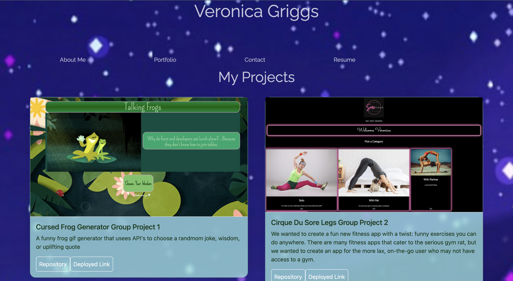

# <React-Portfolio>

## Description

I created this page as an accessible portfolio page for future carreer prospects and employers to easily be able to access my works and contact information as well as my resume

## Installation

Simply follow the URL below and view the pages

## Link

https://veronicagriggs.netlify.app/

## Usage

Once the landing page has loaded simply click on the elements in the nav bar and view the pages.

## Credits

Alivia Thomas github:https://github.com/17anguyen

## License

MIT